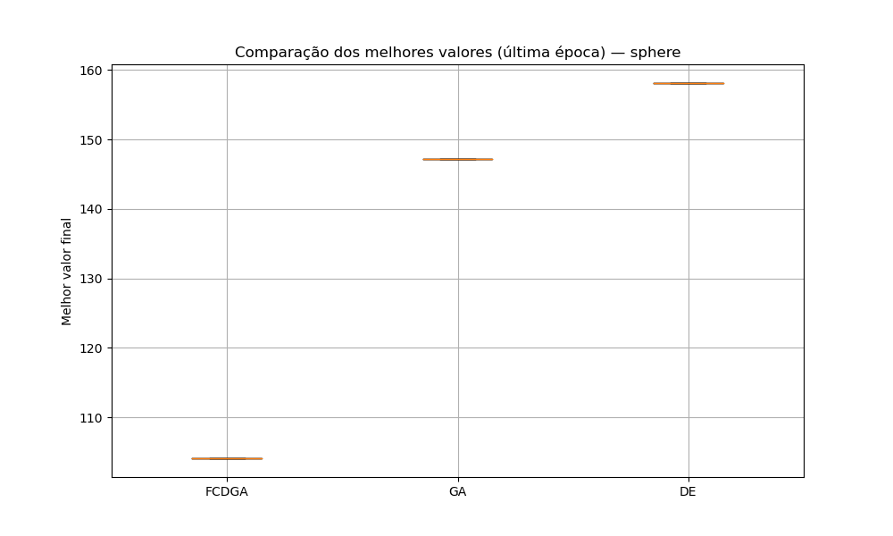

# 🦀 FCDGA — Fiddler Crab-inspired Differential-Genetic Algorithm

**Um operador evolutivo bioinspirado no comportamento de seleção sexual dos caranguejos violinistas (*Uca* spp.), combinando o melhor de Algoritmos Genéticos e Evolução Diferencial.**


---

## 🌊 A inspiração

Caranguejos violinistas machos possuem uma garra hipertrofiada usada em *displays* rítmicos para atrair fêmeas e competir por território. Fêmeas escolhem parceiros com base no sinal visual **e** na aptidão física real do macho — um equilíbrio natural entre "aparência" (exploração) e "qualidade genética" (intensificação).

O **FCDGA** traduz esse mecanismo para otimização contínua:

- 🏝️ **Territórios**: a população é dividida em subgrupos com competição local
- 💪 **Traço sexual sintético**: cada indivíduo carrega um "display" além da aptidão pura
- 🎲 **Seleção sexual probabilística**: chance de vencer um duelo via função sigmoide, combinando aptidão e sinal
- 🧬 **Reprodução diferencial**: a fêmea escolhida atua como vetor-base da recombinação (estilo DE), cruzada com machos vencedores de cada território

O resultado é um híbrido AG + DE que busca aumentar a diversidade populacional e evitar convergência prematura em funções multimodais, sem abrir mão da capacidade de intensificação da Evolução Diferencial clássica.

📄 O paper completo com a fundamentação teórica e metodologia está em [`Latex/fcdga.latex`](Latex/fcdga.latex).

---

## 📊 Resultados

<!--
  Adicione aqui os gráficos mais representativos de src/logs/, por exemplo:
  
  
-->

| Função      | FCDGA | AG clássico | DE/rand/1/bin |
|-------------|:-----:|:-----------:|:-------------:|
| Sphere      |   —   |      —      |       —       |
| Rastrigin   |   —   |      —      |       —       |
| Ackley      |   —   |      —      |       —       |
| Rosenbrock  |   —   |      —      |       —       |
| Griewank    |   —   |      —      |       —       |

> Preencha a tabela com o melhor valor médio encontrado por algoritmo. Curvas de convergência completas em `src/logs/`.

---

## 🚀 Instalação

```bash
git clone https://github.com/otluiz/AG-caranguejos.git
cd AG-caranguejos
python -m venv .venv
source .venv/bin/activate  # Windows: .venv\Scripts\activate
pip install -r requirements.txt
```

## ▶️ Uso rápido

```python
from src.algorithms.fcdga import FCDGA
from src.benchmarks.benchmarks import rastrigin

algo = FCDGA(
    func=rastrigin,
    dim=30,
    pop_size=50,
    territorios=5,
    max_iter=500,
)

melhor_solucao, melhor_fitness = algo.run()
print(f"Melhor fitness encontrado: {melhor_fitness}")
```

Ou rode a bateria completa de benchmarks (compara FCDGA, AG clássico e DE):

```bash
python src/benchmarks/benchmarks.py
```

Os resultados (CSVs de convergência + gráficos) são salvos em `src/logs/<algoritmo>/<funcao>/`.

---

## 🗂️ Estrutura do projeto

```
AG-caranguejos/
├── Latex/                    # Paper (fonte LaTeX)
│   └── fcdga.latex
├── src/
│   ├── algorithms/
│   │   ├── fcdga.py           # Algoritmo proposto
│   │   ├── ga.py               # AG clássico (baseline)
│   │   └── de.py                # DE/rand/1/bin (baseline)
│   ├── benchmarks/
│   │   └── benchmarks.py     # Funções: Sphere, Rastrigin, Ackley, Rosenbrock, Griewank
│   ├── caranguejos_violonistas.py
│   └── logs/                    # Saídas de execução (não versionado)
└── README.md
```

---

## 🧪 Funções de benchmark

| Função      | Modalidade    | Domínio típico     |
|-------------|---------------|---------------------|
| Sphere      | Unimodal      | [-5.12, 5.12]        |
| Rastrigin   | Multimodal    | [-5.12, 5.12]        |
| Ackley      | Multimodal    | [-32.768, 32.768]    |
| Rosenbrock  | Unimodal (vale estreito) | [-5, 10]  |
| Griewank    | Multimodal    | [-600, 600]          |

---

## 🛣️ Roadmap

- [ ] Fator diferencial `F` adaptativo (estilo jDE/SHADE)
- [ ] Parâmetros `α`/`β` da seleção sexual adaptativos ao longo das gerações
- [ ] Custo do sinal `λ·C(s(x))` com decaimento dinâmico
- [ ] Testes estatísticos formais (Wilcoxon/Friedman) entre FCDGA, AG e DE
- [ ] Publicação dos resultados finais no paper
- [ ] Empacotar como biblioteca (`pip install fcdga`)

Acompanhe o progresso no [GitHub Project](../../projects) do repositório.

---

## 🤝 Contribuindo

Contribuições são bem-vindas! Sinta-se à vontade para abrir uma *issue* com sugestões, bugs ou novas funções de benchmark, ou enviar um *pull request*.

```bash
git checkout -b feature/minha-melhoria
git commit -m "Descrição da melhoria"
git push origin feature/minha-melhoria
```

---

## 📚 Referências

- HOLLAND, J. H. *Adaptation in natural and artificial systems*. University of Michigan Press, 1975.
- STORN, R.; PRICE, K. Differential evolution — A simple and efficient heuristic for global optimization. *Journal of Global Optimization*, 1997.
- FOSTER, S. A. The evolution of behavior in fiddler crabs. *Biological Reviews*, 1996.
- BASOLO, A. L. Sexual selection and signal evolution in fiddler crabs. *Journal of Experimental Biology*, 2000.
- ANDERSSON, M. *Sexual Selection*. Princeton University Press, 1994.

---

## 📄 Licença

Este projeto está sob a licença MIT — veja o arquivo [LICENSE](LICENSE) para detalhes.

---

<p align="center">
  <i>Feito com 🦀 e evolução diferencial, por <a href="https://github.com/otluiz">Othon Luiz</a></i>
</p>
