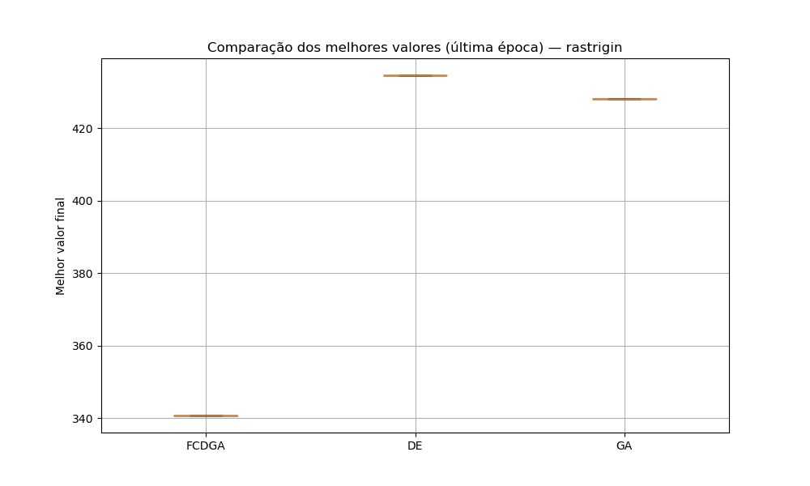
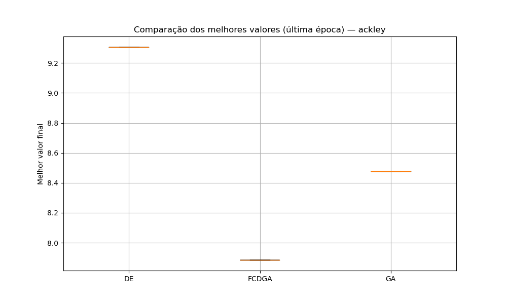

# 🦀 FCDGA — Fiddler Crab-inspired Differential-Genetic Algorithm

**Um operador evolutivo bioinspirado no comportamento de seleção sexual dos caranguejos violinistas (*Uca* spp.), combinando o melhor de Algoritmos Genéticos e Evolução Diferencial.**


---

## 🌊 A inspiração

Caranguejos violinistas machos possuem uma garra hipertrofiada usada em *displays* rítmicos para atrair fêmeas e competir por território. Fêmeas escolhem parceiros com base no sinal visual **e** na aptidão física real do macho — um equilíbrio natural entre "aparência" (exploração) e "qualidade genética" (intensificação).

O **FCDGA** traduz esse mecanismo para otimização contínua:

- 🏝️ **Territórios**: a população é dividida em subgrupos com competição local
- 💪 **Traço sexual sintético**: cada indivíduo carrega um "display" além da aptidão pura
- 🎲 **Seleção sexual probabilística**: chance de vencer um duelo via função sigmoide, combinando aptidão e sinal
- 🧬 **Reprodução diferencial**: a fêmea escolhida atua como vetor-base da recombinação (estilo DE), cruzada com machos vencedores de cada território

O resultado é um híbrido AG + DE que busca aumentar a diversidade populacional e evitar convergência prematura em funções multimodais, sem abrir mão da capacidade de intensificação da Evolução Diferencial clássica.

📄 O paper completo com a fundamentação teórica e metodologia está em [`Latex/fcdga.latex`](Latex/fcdga.latex).

---

## 📊 Resultados

Em funções **multimodais**, o FCDGA supera consistentemente AG clássico e DE/rand/1/bin em qualidade de solução — pagando isso com um custo computacional maior por época. É exatamente o trade-off exploração-vs-custo previsto na fundamentação teórica do paper.

<p align="center">
  
  
</p>

| Função     | FCDGA (melhor valor) | AG clássico | DE/rand/1/bin | Tempo/época FCDGA | Tempo/época DE | Overhead FCDGA |
|------------|:---------------------:|:-----------:|:--------------:|:-------------------:|:-----------------:|:-----------------:|
| Rastrigin  | **≈ 340**              | ≈ 428        | ≈ 434            | ≈ 0,0105 s           | ≈ 0,0042 s          | ~2,5×               |
| Ackley     | **≈ 7,89**             | ≈ 8,48        | ≈ 9,30            | ≈ 0,0120 s           | ≈ 0,0050 s          | ~2,4×               |
| Sphere     | —                       | —            | —                 | —                     | —                    | —                   |
| Rosenbrock | —                       | —            | —                 | —                     | —                    | —                   |
| Griewank   | —                       | —            | —                 | —                     | —                    | —                   |

> Menor é melhor para todas as colunas de valor. Preencha as linhas de Sphere, Rosenbrock e Griewank com seus próprios logs — nessas funções unimodais/menos multimodais, é esperado que DE clássico seja competitivo ou superior, o que é um resultado igualmente honesto e relevante para reportar.

Curvas de convergência e gráficos completos de tempo por época em `src/logs/`.

---

## 🚀 Instalação

```bash
git clone https://github.com/otluiz/AG-caranguejos.git
cd AG-caranguejos
python -m venv .venv
source .venv/bin/activate  # Windows: .venv\Scripts\activate
pip install -r requirements.txt
```

## ▶️ Uso rápido

```python
from src.algorithms.fcdga import fcdga
from src.benchmarks.benchmarks import rastrigin

melhor_fitness = fcdga(
    func=rastrigin,
    dim=30,
    pop_size=50,
    gens=500,
    n_terr=5,
)
print(f"Melhor fitness encontrado: {melhor_fitness}")
```

Para acompanhar a curva de convergência real (monotonicamente decrescente, não o
melhor-por-geração bruto):

```python
melhor_fitness, historico = fcdga(rastrigin, dim=30, gens=500, return_history=True)
```

Ou rode a bateria completa de benchmarks (compara FCDGA, AG clássico e DE):

```bash
python src/benchmarks/benchmarks.py
```

Os resultados (CSVs de convergência + gráficos) são salvos em `src/logs/<algoritmo>/<funcao>/`.

---

## 🗂️ Estrutura do projeto

```
AG-caranguejos/
├── Latex/                    # Paper (fonte LaTeX)
│   └── fcdga.latex
├── src/
│   ├── algorithms/
│   │   ├── fcdga.py           # Algoritmo proposto (com hook F_schedule p/ meta-evolução)
│   │   ├── ga.py               # AG clássico (baseline)
│   │   └── de.py                # DE/rand/1/bin (baseline)
│   ├── benchmarks/
│   │   └── benchmarks.py     # Funções: Sphere, Rastrigin, Ackley, Rosenbrock, Griewank
│   ├── caranguejos_violonistas.py
│   └── logs/                    # Saídas de execução (não versionado)
├── meta/                       # Meta-evolução: LLM local evolui os hiperparâmetros do FCDGA
│   ├── sandbox.py               # Validação (AST) + execução isolada de código gerado
│   ├── llm_ops.py                # Crossover/mutação via Ollama
│   └── meta_loop.py               # Orquestração do ciclo de meta-evolução
├── docs/figures/               # Gráficos curados para este README
├── ROADMAP.md                  # Plano de fases (algoritmo + aplicação real)
└── README.md
```

---

## 🧪 Funções de benchmark

| Função      | Modalidade    | Domínio típico     |
|-------------|---------------|---------------------|
| Sphere      | Unimodal      | [-5.12, 5.12]        |
| Rastrigin   | Multimodal    | [-5.12, 5.12]        |
| Ackley      | Multimodal    | [-32.768, 32.768]    |
| Rosenbrock  | Unimodal (vale estreito) | [-5, 10]  |
| Griewank    | Multimodal    | [-600, 600]          |

---

## 🤖 Meta-evolução: um LLM local evolui o próprio algoritmo

Além de otimizar funções matemáticas, o FCDGA pode evoluir **seus próprios
hiperparâmetros** — em vez de valores fixos de `F` (fator diferencial), um LLM local
(via [Ollama](https://ollama.com)) gera e recombina *funções de adaptação* de `F`,
usando a mesma lógica de seleção sexual do algoritmo, agora aplicada a variantes de
código:

```python
from meta.meta_loop import rodar_meta_evolucao

melhor = rodar_meta_evolucao(tamanho_pop=6, geracoes=5)
print(melhor.codigo)  # a função de adaptação de F que melhor performou nos benchmarks
```

Todo código gerado passa por validação estática (AST) e execução isolada em
subprocesso com timeout antes de ser aceito — ver `meta/sandbox.py`. Testado
localmente com `phi3:3.8b` rodando em container Docker (4GB VRAM).

---

## 🏛️ Aplicação real: LexLearn

Esse mesmo mecanismo está sendo levado para calibrar parâmetros de produção da
plataforma educacional LexLearn — a começar pelo limiar de similaridade do cache de
resumos de leis (CF, CC, CPC, ECA). Arquitetura de integração, alterações de schema e
o motivo de usar Optuna em vez do FCDGA nesse caso específico estão documentados em
`optimizer_worker_integration.md` (repositório do LexLearn).

---

## 🛣️ Roadmap

Plano completo, com fases concluídas e planejadas (algoritmo + aplicação real), em
[`ROADMAP.md`](ROADMAP.md). Resumo:

- [x] Correção de bugs de elitismo e fitness efetivo (Fase 0)
- [x] Meta-evolução de hiperparâmetros via LLM local (Fase 1)
- [ ] MVP de otimização aplicada ao LexLearn — threshold de similaridade (Fase 2)
- [ ] Evolução de prompts de resumo e quiz (Fase 3)
- [ ] Chunking hierárquico e pesos de ranking do RAG (Fase 4)
- [ ] Testes estatísticos formais (Wilcoxon/Friedman) entre FCDGA, AG e DE
- [ ] Publicação dos resultados finais no paper

Acompanhe o progresso no [GitHub Project](../../projects) do repositório.

---

## 🤝 Contribuindo

Contribuições são bem-vindas! Sinta-se à vontade para abrir uma *issue* com sugestões, bugs ou novas funções de benchmark, ou enviar um *pull request*.

```bash
git checkout -b feature/minha-melhoria
git commit -m "Descrição da melhoria"
git push origin feature/minha-melhoria
```

---

## 📚 Referências

- HOLLAND, J. H. *Adaptation in natural and artificial systems*. University of Michigan Press, 1975.
- STORN, R.; PRICE, K. Differential evolution — A simple and efficient heuristic for global optimization. *Journal of Global Optimization*, 1997.
- FOSTER, S. A. The evolution of behavior in fiddler crabs. *Biological Reviews*, 1996.
- BASOLO, A. L. Sexual selection and signal evolution in fiddler crabs. *Journal of Experimental Biology*, 2000.
- ANDERSSON, M. *Sexual Selection*. Princeton University Press, 1994.

---

## 📄 Licença

Este projeto está sob a licença MIT — veja o arquivo [LICENSE](LICENSE) para detalhes.

---

<p align="center">
  <i>Feito com 🦀 e evolução diferencial, por <a href="https://github.com/otluiz">Othon Luiz</a></i>
</p>
