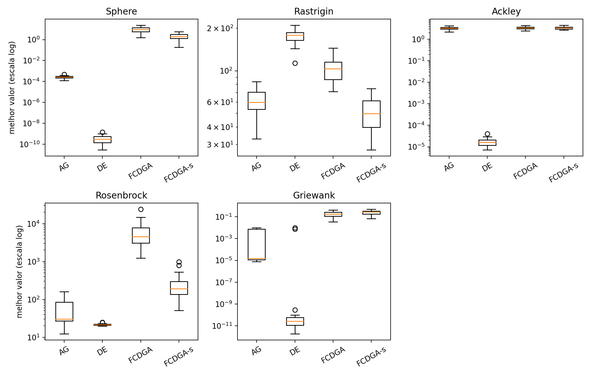
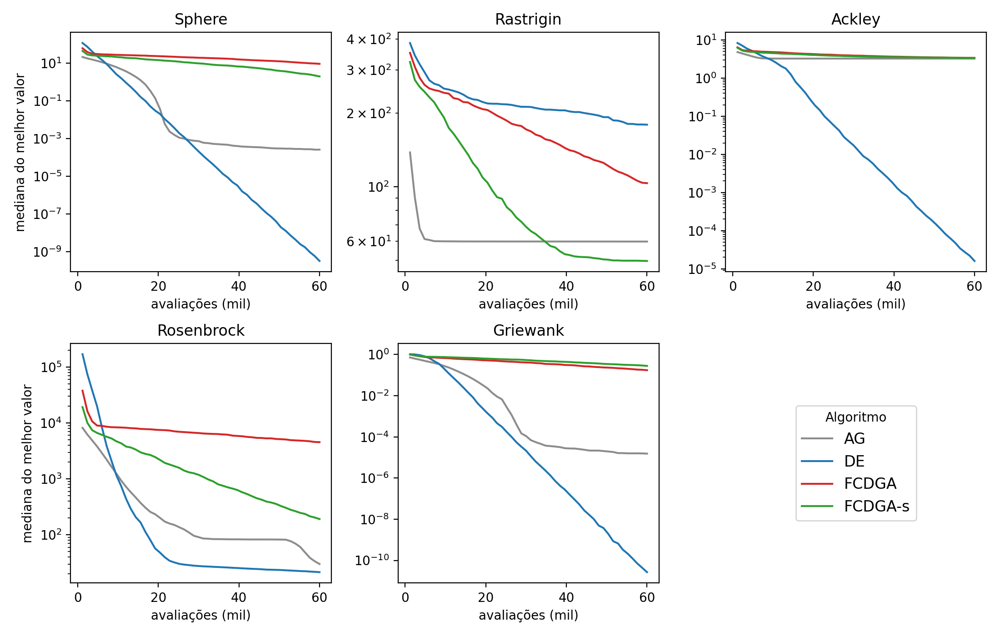

# Experimento: FCDGA x AG x DE com orçamento igual de avaliações

Experimento usado no artigo *"Caranguejos violinistas e evolução diferencial:
avaliação experimental de um operador de seleção sexual para otimização contínua"*
(Revista Presciência, submissão prevista).

## Protocolo

- **Algoritmos**: `AG` (src/algorithms/ga.py), `DE` (DE/rand/1/bin canônico, ver
  abaixo), `FCDGA` (src/algorithms/fcdga.py, sem alterações) e `FCDGA-s` (idêntico
  ao FCDGA, com o sinal do termo de aptidão invertido na seleção sexual).
- **Funções**: Sphere, Rastrigin, Ackley, Rosenbrock, Griewank (src/benchmarks), D = 30.
- **Orçamento**: 60.000 avaliações da função objetivo por execução (2.000 × D),
  imposto por um invólucro que conta as avaliações, guarda o melhor valor já visto e
  interrompe o algoritmo no limite. Toda avaliação conta, inclusive as reavaliações
  do duelo do FCDGA.
- **Repetições**: 30 execuções por algoritmo e função, com semente `1000*run + 17`,
  igual para todos os algoritmos (600 execuções no total).
- **Estatística**: Mann-Whitney bilateral com correção de Holm, por função, e
  Friedman sobre as medianas.

### Por que um DE diferente do `src/algorithms/de.py`?

O `de.py` do repositório reavalia `func(pop[i])` a cada comparação, o que dobraria
o consumo de avaliações sob orçamento fixo. Ele também não força uma coordenada do
mutante (`j_rand`) e pode sortear `i` entre `r1, r2, r3`. O `de_padrao()` do
`experimento.py` guarda o fitness e corrige os dois pontos, usando os mesmos
`F = 0.6` e `CR = 0.9`.

### O que é o FCDGA-s?

Em `fcdga.py`, `p = sigmoid(alpha*(fi_eff - fj_eff) + beta*(si - sj))` é a
probabilidade de `xi` vencer. Como o problema é de minimização, se `xi` é melhor,
`fi_eff - fj_eff < 0` e `p < 0.5`, ou seja, o duelo favorece o **pior**. O FCDGA-s
usa `fj_eff - fi_eff` e mantém todo o resto igual.

## Resultados (medianas de 30 execuções; menor é melhor)

| Função     | AG       | DE           | FCDGA    | FCDGA-s   |
|------------|---------:|-------------:|---------:|----------:|
| Sphere     | 2,58e-04 | **3,16e-10** | 9,31     | 2,00      |
| Rastrigin  | 59,73    | 179,11       | 103,38   | **49,77** |
| Ackley     | 3,25     | **1,60e-05** | 3,38     | 3,37      |
| Rosenbrock | 30,06    | **21,52**    | 4,55e+03 | 191,69    |
| Griewank   | 1,53e-05 | **2,68e-11** | 0,17     | 0,28      |

- A DE teve a menor mediana em 4 de 5 funções.
- O FCDGA-s teve a menor mediana em Rastrigin: melhor que o AG (p = 0,013) e que a
  DE (p < 0,001), com correção de Holm.
- O FCDGA-s superou o FCDGA original em Sphere, Rastrigin e Rosenbrock (p < 0,001).
- Friedman: postos médios DE 1,6; AG 2,0; FCDGA-s 2,8; FCDGA 3,6 (p = 0,069).

Os números do README principal foram obtidos com o mesmo número de **gerações**. Por
geração, o FCDGA faz cerca de 140 avaliações, a DE 100 e o AG 50, o que explica a
diferença em relação a estes resultados.




## Como reproduzir

```bash
# na raiz do repositório
python experimentos/orcamento_igual/experimento.py            # ~25 min em 7 processos
python experimentos/orcamento_igual/analise.py resultados.jsonl experimentos/orcamento_igual/figuras
```

Variáveis de ambiente: `BUDGET` (padrão 60000), `RUNS` (30), `PROCS` (7) e `OUT`
(`resultados.jsonl`). O arquivo `resultados.jsonl` desta pasta tem as 600 execuções
originais: melhor valor, avaliações usadas, tempo, semente e curva de convergência em
50 pontos. Ambiente: Python 3.11, NumPy 1.24, SciPy 1.10.
